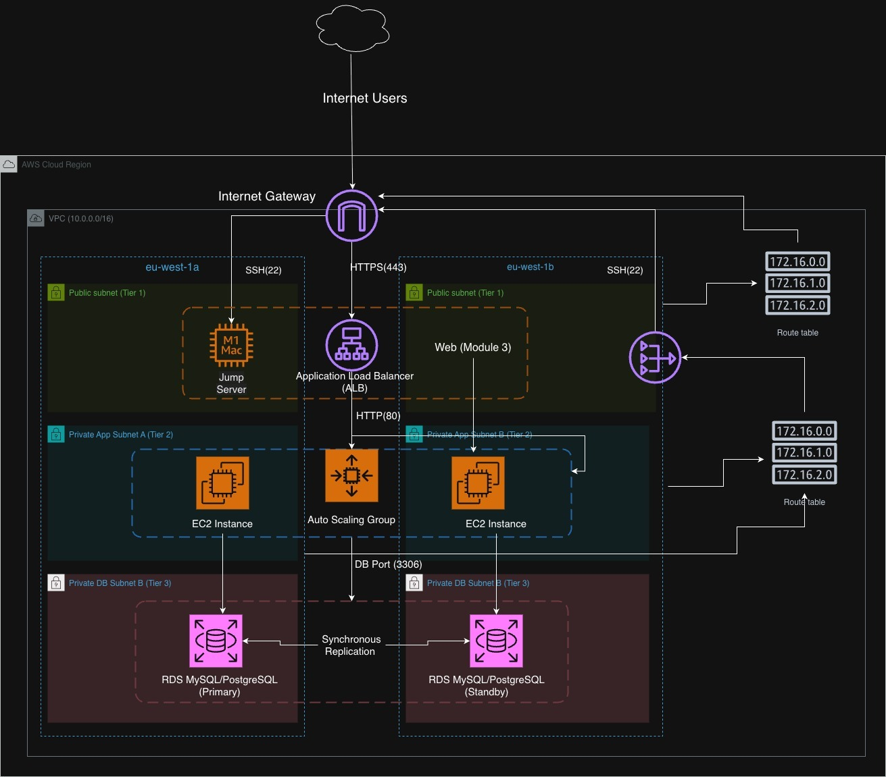

# 3-Tier AWS Architecture with Terraform Modules

[](https://www.terraform.io/)
[](https://aws.amazon.com/)

A production-ready, modular Terraform project that deploys a secure 3-tier architecture on AWS with high availability, auto-scaling, and best practices for infrastructure as code.

## Table of Contents

- [Architecture Overview](#architecture-overview)
- [Project Structure](#project-structure)
- [Prerequisites](#prerequisites)
- [Module Descriptions](#module-descriptions)
- [Deployment Instructions](#deployment-instructions)
- [Variables Reference](#variables-reference)
- [Outputs](#outputs)
- [Security Considerations](#security-considerations)
- [Testing & Validation](#testing--validation)
- [Troubleshooting](#troubleshooting)
- [Cleanup](#cleanup)
- [Contributing](#contributing)

---

## Architecture Overview

This project implements a scalable, highly available 3-tier architecture on AWS:

### Architecture Diagram

### Architecture Layers

#### **Tier 1: Presentation Layer** (Public Subnets)

- **Application Load Balancer (ALB)** - Distributes incoming HTTP/HTTPS traffic
- **Internet Gateway** - Enables internet connectivity
- **Public Subnets** - Span multiple availability zones for high availability
- **Optional Bastion Host** - Secure access to private resources

#### **Tier 2: Application Layer** (Private App Subnets)

- **Auto Scaling Group (ASG)** - Automatically scales EC2 instances based on demand
- **Launch Template** - Defines EC2 instance configuration
- **NAT Gateway** - Enables outbound internet access for private instances
- **Private App Subnets** - Isolated from direct internet access

#### **Tier 3: Data Layer** (Private DB Subnets)

- **RDS MySQL/PostgreSQL** - Managed relational database service
- **Multi-AZ Deployment** - Automatic failover for high availability
- **DB Subnet Group** - Spans multiple availability zones
- **Private DB Subnets** - Maximum isolation for data security

### Key Features

**High Availability** - Multi-AZ deployment across 2 availability zones  
 **Auto Scaling** - Dynamic scaling based on traffic patterns  
 **Security** - Defense in depth with multiple security groups and private subnets  
 **Modular Design** - Reusable Terraform modules for easy maintenance  
 **Infrastructure as Code** - Version-controlled, reproducible deployments  
**Cost Optimized** - Efficient resource utilization with auto-scaling

---

## 📁 Project Structure

```
3tier-project/
├── main.tf                    # Root module - orchestrates all modules
├── provider.tf                # AWS provider configuration
├── variables.tf               # Root level input variables
├── outputs.tf                 # Root level outputs
├── terraform.tfvars          # Variable values (DO NOT commit secrets)
├── README.md                 # This file
├── tier3.jpg  # Visual architecture diagram
└── modules/
    ├── networking/
    │   ├── main.tf           # VPC, subnets, gateways, route tables
    │   ├── variables.tf      # Networking module inputs
    │   └── outputs.tf        # VPC ID, subnet IDs, etc.
    ├── security/
    │   ├── main.tf           # Security groups and rules
    │   ├── variables.tf      # Security module inputs
    │   └── outputs.tf        # Security group IDs
    ├── alb/
    │   ├── main.tf           # ALB, listeners, target groups
    │   ├── variables.tf      # ALB module inputs
    │   └── outputs.tf        # ALB DNS, target group ARN
    ├── compute/
    │   ├── main.tf           # ASG, launch template, EC2 instances
    │   ├── variables.tf      # Compute module inputs
    │   └── outputs.tf        # ASG name, instance IDs
    └── database/
        ├── main.tf           # RDS instance, subnet group
        ├── variables.tf      # Database module inputs
        └── outputs.tf        # RDS endpoint, connection info
```

---

## Prerequisites

Before deploying this infrastructure, ensure you have:

### Required Tools

- **Terraform** >= 1.0.0

  ```bash
  # Install Terraform (macOS)
  brew install terraform

  # Install Terraform (Linux)
  wget https://releases.hashicorp.com/terraform/1.6.0/terraform_1.6.0_linux_amd64.zip
  unzip terraform_1.6.0_linux_amd64.zip
  sudo mv terraform /usr/local/bin/
  ```

- **AWS CLI** >= 2.0

  ```bash
  # Install AWS CLI (macOS)
  brew install awscli

  # Install AWS CLI (Linux)
  curl "https://awscli.amazonaws.com/awscli-exe-linux-x86_64.zip" -o "awscliv2.zip"
  unzip awscliv2.zip
  sudo ./aws/install
  ```

### AWS Account Requirements

- **AWS Account** with appropriate permissions
- **IAM User** or **IAM Role** with the following managed policies:
  - `AmazonVPCFullAccess`
  - `AmazonEC2FullAccess`
  - `AmazonRDSFullAccess`
  - `ElasticLoadBalancingFullAccess`
  - `IAMReadOnlyAccess`

### AWS Credentials Configuration

```bash
# Configure AWS credentials
aws configure

# Or set environment variables
export AWS_ACCESS_KEY_ID="your-access-key"
export AWS_SECRET_ACCESS_KEY="your-secret-key"
export AWS_DEFAULT_REGION="us-east-1"
```

### Network Requirements

- Available **VPC CIDR block** (default: 10.0.0.0/16)
- **SSH Key Pair** for EC2 instances (create in AWS Console or via CLI)

```bash
# Create SSH key pair
aws ec2 create-key-pair --key-name 3tier-key --query 'KeyMaterial' --output text > 3tier-key.pem
chmod 400 3tier-key.pem
```

---

## Module Descriptions

### 1. Networking Module (`modules/networking`)

**Purpose:** Creates the foundational network infrastructure for the 3-tier architecture.

**Resources Created:**

- 1 VPC with DNS hostnames enabled
- 2 Public Subnets (for ALB)
- 2 Private App Subnets (for EC2 instances)
- 2 Private DB Subnets (for RDS)
- 1 Internet Gateway
- 1 NAT Gateway (for private subnet internet access)
- Route Tables and Route Table Associations

**Key Inputs:**

- `vpc_cidr` - CIDR block for VPC (e.g., "10.0.0.0/16")
- `public_subnet_cidrs` - List of public subnet CIDRs
- `private_app_subnet_cidrs` - List of private app subnet CIDRs
- `private_db_subnet_cidrs` - List of private DB subnet CIDRs
- `availability_zones` - List of AZs to use

**Outputs:**

- `vpc_id` - VPC identifier
- `public_subnet_ids` - List of public subnet IDs
- `private_app_subnet_ids` - List of private app subnet IDs
- `private_db_subnet_ids` - List of private DB subnet IDs
- `internet_gateway_id` - IGW identifier
- `nat_gateway_id` - NAT Gateway identifier

---

### 2. Security Module (`modules/security`)

**Purpose:** Manages all security groups and firewall rules for the architecture.

**Resources Created:**

- **ALB Security Group** - Allows inbound HTTP/HTTPS traffic
- **App Security Group** - Allows traffic from ALB and SSH from bastion
- **DB Security Group** - Allows MySQL/PostgreSQL traffic from app tier
- **Bastion Security Group** (optional) - SSH access from specific IPs

**Security Group Rules:**

| Security Group | Direction | Protocol | Port | Source     |
| -------------- | --------- | -------- | ---- | ---------- |
| ALB SG         | Ingress   | TCP      | 80   | 0.0.0.0/0  |
| ALB SG         | Ingress   | TCP      | 443  | 0.0.0.0/0  |
| App SG         | Ingress   | TCP      | 3000 | ALB SG     |
| App SG         | Ingress   | ICMP     | -    | ALB SG     |
| App SG         | Ingress   | TCP      | 22   | Bastion SG |
| DB SG          | Ingress   | TCP      | 3306 | App SG     |

**Key Inputs:**

- `vpc_id` - VPC where security groups will be created
- `allowed_cidr_blocks` - List of CIDRs allowed to access bastion

**Outputs:**

- `alb_security_group_id`
- `app_security_group_id`
- `db_security_group_id`
- `bastion_security_group_id`

---

### 3. ALB Module (`modules/alb`)

**Purpose:** Creates and configures the Application Load Balancer for traffic distribution.

**Resources Created:**

- Application Load Balancer
- ALB Target Group (with health checks)
- HTTP/HTTPS Listener
- Target Group Attachments

**Health Check Configuration:**

- Path: `/health`
- Interval: 30 seconds
- Timeout: 5 seconds
- Healthy threshold: 2
- Unhealthy threshold: 3

**Key Inputs:**

- `vpc_id` - VPC identifier
- `public_subnet_ids` - Subnets where ALB will be deployed
- `security_group_id` - ALB security group
- `target_port` - Port where targets listen (default: 80)

**Outputs:**

- `alb_dns_name` - DNS name to access the application
- `alb_arn` - ALB Amazon Resource Name
- `target_group_arn` - Target group ARN
- `alb_zone_id` - Route 53 zone ID for the ALB

---

### 4. Compute Module (`modules/compute`)

**Purpose:** Provisions EC2 instances or Auto Scaling Group for the application tier.

**Resources Created:**

- Launch Template (with user data script)
- Auto Scaling Group with scaling policies
- CloudWatch Alarms for scaling
- IAM Role and Instance Profile (for SSM access)

**Auto Scaling Configuration:**

- **Desired Capacity:** 1 instance
- **Minimum Size:** 1 instance
- **Maximum Size:** 2 instances
- **Health Check Type:** ELB
- **Health Check Grace Period:** 300 seconds (5 minutes)

**Scaling Policies:**

- **Scale Up:** When CPU > 70% for 2 minutes
- **Scale Down:** When CPU < 30% for 5 minutes

**User Data Script:**

The compute module automatically:
- Installs Node.js 18
- Clones the application from GitHub (https://github.com/Asheryram/todo-app)
- Retrieves database credentials from AWS Secrets Manager
- Configures environment variables
- Waits for database connectivity
- Starts the Node.js application on port 3000
- Validates application health via `/health` endpoint

**Key Inputs:**

- `ami_id` - AMI to use (retrieved via SSM Parameter)
- `instance_type` - EC2 instance type (default: t3.micro)
- `key_name` - SSH key pair name
- `private_subnet_ids` - Subnets for EC2 instances
- `security_group_ids` - List of security groups
- `target_group_arns` - ALB target group ARN

**Outputs:**

- `asg_name` - Auto Scaling Group name
- `launch_template_id` - Launch Template identifier
- `asg_arn` - ASG Amazon Resource Name

---

### 5. Database Module (`modules/database`)

**Purpose:** Creates a managed RDS instance with Multi-AZ support.

**Resources Created:**

- RDS DB Instance (MySQL or PostgreSQL)
- DB Subnet Group
- DB Parameter Group (optional)
- DB Option Group (optional)

**Database Configuration:**

- **Engine:** MySQL 8.0 or PostgreSQL 14
- **Instance Class:** db.t3.micro (adjustable)
- **Storage:** 20 GB SSD (gp3)
- **Multi-AZ:** Enabled for high availability
- **Backup Retention:** 7 days
- **Automated Backups:** Enabled
- **Encryption:** Enabled at rest

**Key Inputs:**

- `db_name` - Database name
- `db_username` - Master username
- `db_password` - Master password (use secrets manager in production)
- `db_subnet_ids` - Private DB subnet IDs
- `security_group_ids` - DB security group IDs
- `engine` - Database engine (mysql or postgres)
- `instance_class` - RDS instance type

**Outputs:**

- `db_endpoint` - Database connection endpoint
- `db_port` - Database port
- `db_name` - Database name
- `db_instance_id` - RDS instance identifier

---

## Deployment Instructions

### Step 1: Clone the Repository

```bash
git clone https://github.com/yourusername/3tier-terraform-project.git
cd 3tier-terraform-project
```

### Step 2: Configure Variables

Create a `terraform.tfvars` file with your specific values:

```hcl
# terraform.tfvars
project_name = "3tier-app"
environment  = "dev"
owner        = "your-name"

# Network Configuration
vpc_cidr                = "10.0.0.0/16"
availability_zones      = ["us-east-1a", "us-east-1b"]
public_subnet_cidrs     = ["10.0.1.0/24", "10.0.2.0/24"]
private_app_subnet_cidrs = ["10.0.11.0/24", "10.0.12.0/24"]
private_db_subnet_cidrs  = ["10.0.21.0/24", "10.0.22.0/24"]

# Compute Configuration
instance_type = "t3.micro"
key_name      = "3tier-key"  # Your SSH key pair name
min_size      = 1
max_size      = 4
desired_size  = 2

# Database Configuration
db_name       = "appdb"
db_username   = "admin"
db_password   = "YourStrongPassword123!"  # Use AWS Secrets Manager in production
db_engine     = "mysql"
db_instance_class = "db.t3.micro"

# Security
allowed_cidr_blocks = ["your.ip.address/32"]  # Replace with your IP
```

**Security Note:** Never commit `terraform.tfvars` with sensitive data to version control. Add it to `.gitignore`.

### Step 3: Initialize Terraform

```bash
# Initialize Terraform and download providers
terraform init
```

### Step 4: Validate Configuration

```bash
# Validate syntax and configuration
terraform validate

# Format code
terraform fmt -recursive
```

### Step 5: Plan Deployment

```bash
# Generate and review execution plan
terraform plan -out=tfplan

# Review the plan carefully before applying
```

### Step 6: Deploy Infrastructure

```bash
# Apply the Terraform configuration
terraform apply tfplan

# Or apply with auto-approval (use with caution)
terraform apply -auto-approve
```

**Deployment Time:** Approximately 10-15 minutes

### Step 7: Verify Deployment

After successful deployment, Terraform will output important information:

```hcl
Outputs:

alb_dns_name = "3tier-alb-1234567890.us-east-1.elb.amazonaws.com"
rds_endpoint = "3tier-db.abcdefg.us-east-1.rds.amazonaws.com:3306"
asg_name     = "3tier-asg-dev"
vpc_id       = "vpc-0a1b2c3d4e5f6g7h8"
```

**Test the Application:**

```bash
# Get ALB DNS from output
ALB_DNS=$(terraform output -raw alb_dns_name)

# Test HTTP endpoint
curl http://$ALB_DNS

# Or open in browser
open http://$ALB_DNS
```

---

## 📊 Variables Reference

### Root Module Variables

| Variable              | Type         | Default                      | Required | Description                      |
| --------------------- | ------------ | ---------------------------- | -------- | -------------------------------- |
| `project_name`        | string       | "3tier-app"                  | No       | Project name for resource naming |
| `environment`         | string       | "dev"                        | No       | Environment (dev/staging/prod)   |
| `owner`               | string       | -                            | Yes      | Owner name for tagging           |
| `aws_region`          | string       | "eu-west-1"                  | No       | AWS region for deployment        |
| `vpc_cidr`            | string       | "10.0.0.0/16"                | No       | CIDR block for VPC               |
| `availability_zones`  | list(string) | ["us-east-1a", "us-east-1b"] | No       | AZs for multi-AZ deployment      |
| `instance_type`       | string       | "t3.micro"                   | No       | EC2 instance type                |
| `key_name`            | string       | -                            | Yes      | SSH key pair name                |
| `db_name`             | string       | -                            | Yes      | RDS database name                |
| `db_username`         | string       | -                            | Yes      | RDS master username              |
| `db_password`         | string       | -                            | Yes      | RDS master password              |
| `allowed_cidr_blocks` | list(string) | []                           | No       | CIDRs allowed for bastion access |

### Module-Specific Variables

See individual module README files for detailed variable documentation:

- `modules/networking/README.md`
- `modules/security/README.md`
- `modules/alb/README.md`
- `modules/compute/README.md`
- `modules/database/README.md`

---

## Outputs

### Root Module Outputs

| Output           | Description                | Example                           |
| ---------------- | -------------------------- | --------------------------------- |
| `alb_dns_name`   | ALB DNS endpoint           | `3tier-alb-123.elb.amazonaws.com` |
| `alb_zone_id`    | Route 53 zone ID for ALB   | `Z35SXDOTRQ7X7K`                  |
| `rds_endpoint`   | Database connection string | `db.123.rds.amazonaws.com:3306`   |
| `asg_name`       | Auto Scaling Group name    | `3tier-asg-dev`                   |
| `vpc_id`         | VPC identifier             | `vpc-0a1b2c3d`                    |
| `nat_gateway_ip` | NAT Gateway Elastic IP     | `54.123.45.67`                    |

### Accessing Outputs

```bash
# List all outputs
terraform output

# Get specific output
terraform output alb_dns_name

# Get raw output (without quotes)
terraform output -raw alb_dns_name

# Output to JSON
terraform output -json > outputs.json
```

---

## Security Considerations

### Network Security

**Private Subnets** - Application and database tiers in private subnets without direct internet access  
**Security Groups** - Least privilege firewall rules with port-specific access  
 **NAT Gateway** - Controlled outbound internet access for updates  
**Network ACLs** - Additional subnet-level security (optional)

### Access Control

**IAM Roles** - EC2 instances use IAM roles, not hardcoded credentials  
 **Bastion Host** - Secure jump box for SSH access to private instances  
 **Key Pairs** - SSH access controlled via AWS key pairs  
 **Security Group Rules** - Restrict SSH access to known IP addresses

### Data Protection

**Encryption at Rest** - RDS databases encrypted with AWS KMS  
 **Encryption in Transit** - HTTPS/TLS for data in motion (configure SSL certificate)  
 **Automated Backups** - RDS automated backups with 7-day retention  
**Multi-AZ** - High availability with automatic failover

### Secrets Management

**Never commit secrets to version control**

**Best Practices:**

```bash
# Use AWS Secrets Manager for sensitive data
aws secretsmanager create-secret \
  --name 3tier/db/password \
  --secret-string "YourStrongPassword123!"

# Reference in Terraform
data "aws_secretsmanager_secret_version" "db_password" {
  secret_id = "3tier/db/password"
}
```

### Compliance

- Enable **AWS CloudTrail** for audit logging
- Enable **AWS Config** for compliance monitoring
- Use **AWS GuardDuty** for threat detection
- Implement **VPC Flow Logs** for network monitoring

---

## Testing & Validation

### 1. Infrastructure Validation

```bash
# Validate Terraform configuration
terraform validate

# Check formatting
terraform fmt -check -recursive

# Security scanning with tfsec
tfsec .

# Cost estimation with Infracost
infracost breakdown --path .
```

### 2. Connectivity Testing

**Test ALB Endpoint:**

```bash
# Get ALB DNS
ALB_DNS=$(terraform output -raw alb_dns_name)

# Test HTTP connection
curl -I http://$ALB_DNS

# Expected: HTTP 200 OK
```

**Test ICMP (Ping) from Bastion:**

```bash
# SSH to bastion host
ssh -i 3tier-key.pem ec2-user@<bastion-public-ip>

# Ping private app server
ping -c 4 <private-app-instance-ip>

# Expected: ICMP replies
```

**Test Database Connection:**

```bash
# From bastion or app server
mysql -h $(terraform output -raw rds_endpoint | cut -d: -f1) \
      -u admin \
      -p appdb

# Or for PostgreSQL
psql -h $(terraform output -raw rds_endpoint | cut -d: -f1) \
     -U admin \
     -d appdb
```

### 3. Auto Scaling Testing

**Simulate Load:**

```bash
# Install stress tool on EC2 instance
sudo yum install -y stress

# Generate CPU load
stress --cpu 8 --timeout 300s

# Watch ASG scale up
watch aws autoscaling describe-auto-scaling-groups \
  --auto-scaling-group-names $(terraform output -raw asg_name)
```

### 4. High Availability Testing

**Simulate AZ Failure:**

```bash
# Terminate instance in one AZ
aws ec2 terminate-instances --instance-ids <instance-id>

# Verify ALB health checks
aws elbv2 describe-target-health \
  --target-group-arn $(terraform output -raw target_group_arn)

# ASG should launch replacement instance
```

---

## 🐛 Troubleshooting

### Common Issues

#### Issue 1: Terraform Init Fails

**Error:** `Failed to download provider`

**Solution:**

```bash
# Clear Terraform cache
rm -rf .terraform .terraform.lock.hcl

# Reinitialize
terraform init
```

#### Issue 2: Insufficient Permissions

**Error:** `UnauthorizedOperation`

**Solution:**

- Verify AWS credentials: `aws sts get-caller-identity`
- Check IAM permissions match prerequisites
- Ensure you have `AdministratorAccess` or equivalent

#### Issue 3: Resource Quota Exceeded

**Error:** `VcpuLimitExceeded`

**Solution:**

```bash
# Request limit increase in AWS Console
# Or use smaller instance types
terraform apply -var="instance_type=t2.micro"
```

#### Issue 4: ALB Returns 503

**Symptoms:** Load balancer returns Service Unavailable

**Troubleshooting:**

```bash
# Check target health
aws elbv2 describe-target-health \
  --target-group-arn <target-group-arn>

# Verify security group allows traffic
# Check application logs on EC2 instances
sudo tail -f /var/log/httpd/error_log
```

#### Issue 5: Cannot Connect to RDS

**Symptoms:** Connection timeout to database

**Checklist:**

- Security group allows traffic from app tier
- Database is in "available" state
- Connection string is correct (check endpoint)
- Network ACLs allow traffic

```bash
# Test from app server
telnet <rds-endpoint> 3306
```

### Debug Mode

```bash
# Enable Terraform debug logging
export TF_LOG=DEBUG
export TF_LOG_PATH=terraform-debug.log

terraform apply
```

### Getting Help

If you encounter issues:

1. Check [GitHub Issues](https://github.com/yourusername/3tier-terraform/issues)
2. Review [Terraform Documentation](https://www.terraform.io/docs)
3. Check [AWS Service Health Dashboard](https://status.aws.amazon.com/)
4. Open a new issue with:
   - Terraform version
   - Error message
   - Debug logs (sanitized)

---

## Cleanup

To avoid ongoing AWS charges, destroy the infrastructure when done:

### Step 1: Backup Important Data

```bash
# Export RDS snapshot (optional)
aws rds create-db-snapshot \
  --db-instance-identifier <db-instance-id> \
  --db-snapshot-identifier final-backup-$(date +%Y%m%d)
```

### Step 2: Destroy Infrastructure

```bash
# Preview resources to be destroyed
terraform plan -destroy

# Destroy all resources
terraform destroy

# Or with auto-approval
terraform destroy -auto-approve
```

**Warning:** This will permanently delete:

- All EC2 instances
- Load Balancers
- RDS database (unless retention policy configured)
- VPC and networking components

### Step 3: Verify Cleanup

```bash
# Check for remaining resources
aws ec2 describe-instances --filters "Name=tag:Project,Values=3tier-iac"
aws elbv2 describe-load-balancers
aws rds describe-db-instances
```

### Estimated Costs

**Daily Cost Estimate (us-east-1):**

- VPC, Subnets, IGW: Free
- NAT Gateway: ~$1.08/day
- ALB: ~$0.60/day
- 2x t3.micro EC2: ~$0.62/day
- db.t3.micro RDS: ~$0.41/day
- EBS Storage: ~$0.10/day

**Total: ~$2.81/day (~$84/month)**

**Cost Savings Tip:** Use `t4g` (ARM-based) instances for 20% savings

---

## Contributing

Contributions are welcome! Please follow these guidelines:

### How to Contribute

1. Fork the repository
2. Create a feature branch (`git checkout -b feature/AmazingFeature`)
3. Make your changes
4. Test thoroughly
5. Commit with conventional commits (`git commit -m 'feat: Add some AmazingFeature'`)
6. Push to the branch (`git push origin feature/AmazingFeature`)
7. Open a Pull Request

### Pull Request Checklist

- [ ] Code follows project style guidelines
- [ ] Tests pass (`terraform validate`, `tfsec`)
- [ ] Documentation updated
- [ ] No sensitive data in commits
- [ ] Branch is up to date with main

---

## Additional Resources

### Documentation

- [AWS Well-Architected Framework](https://aws.amazon.com/architecture/well-architected/)
- [Terraform AWS Provider](https://registry.terraform.io/providers/hashicorp/aws/latest/docs)
- [AWS VPC Documentation](https://docs.aws.amazon.com/vpc/)

### Tutorials

- [Terraform Best Practices](https://www.terraform-best-practices.com/)
- [AWS Auto Scaling](https://docs.aws.amazon.com/autoscaling/)
- [RDS Best Practices](https://docs.aws.amazon.com/AmazonRDS/latest/UserGuide/CHAP_BestPractices.html)

### Tools

- [Terraform](https://www.terraform.io/)
- [tfsec](https://github.com/aquasecurity/tfsec) - Security scanner
- [Infracost](https://www.infracost.io/) - Cost estimation
- [Terragrunt](https://terragrunt.gruntwork.io/) - DRY configurations
